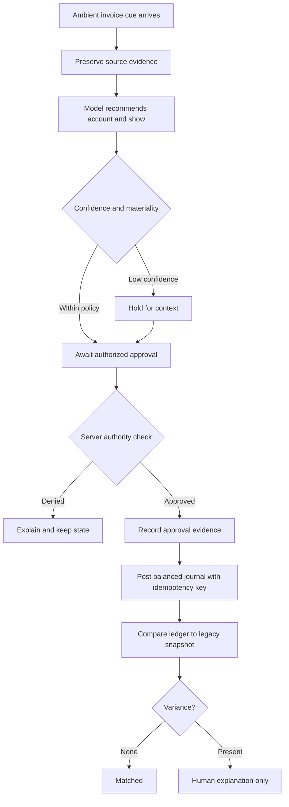
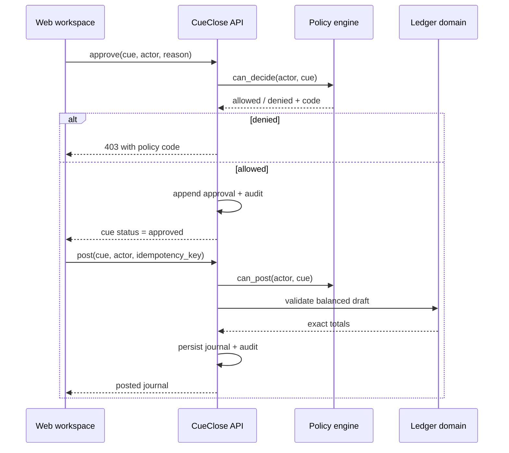

# CueClose workflow

## Happy path

```mermaid
flowchart TD
  A[Ambient invoice cue arrives] --> B[Preserve source evidence]
  B --> C[Model recommends account and show]
  C --> D{Confidence and materiality}
  D -->|Low confidence| H[Hold for context]
  D -->|Within policy| E[Await authorized approval]
  H --> E
  E --> F{Server authority check}
  F -->|Denied| X[Explain and keep state]
  F -->|Approved| G[Record approval evidence]
  G --> P[Post balanced journal with idempotency key]
  P --> R[Compare ledger to legacy snapshot]
  R --> Y{Variance?}
  Y -->|None| M[Matched]
  Y -->|Present| Z[Human explanation only]
```

## Authority boundary

```mermaid
sequenceDiagram
  participant UI as Web workspace
  participant API as CueClose API
  participant Pol as Policy engine
  participant Led as Ledger domain
  UI->>API: approve(cue, actor, reason)
  API->>Pol: can_decide(actor, cue)
  Pol-->>API: allowed / denied + code
  alt denied
    API-->>UI: 403 with policy code
  else allowed
    API->>API: append approval + audit
    API-->>UI: cue status = approved
    UI->>API: post(cue, actor, idempotency_key)
    API->>Pol: can_post(actor, cue)
    API->>Led: validate balanced draft
    Led-->>API: exact totals
    API->>API: persist journal + audit
    API-->>UI: posted journal
  end
```
